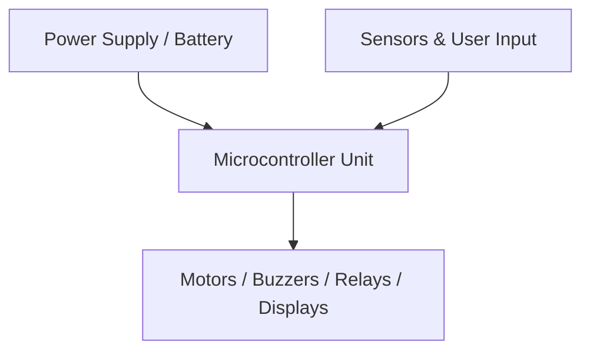

# Proteus Simulated DHT Temperature & Humidity Interface 🌡️💧 - Technical Design & Circuit Architecture

## Hardware Components (BOM)
- ATmega328P Microcontroller
- DHT11 / DHT22 Sensor Model
- LM016L 16x2 HD44780 LCD Display
- 10kΩ Pull-up Resistor
- Proteus .pdsprj Design File

## System Capabilities
- Single-Wire Digital Protocol Bit-Banging Communication
- Real-Time Temperature & Humidity LCD Rendering
- Celsius & Fahrenheit Metric Conversion
- Full Interactive Circuit Simulation
